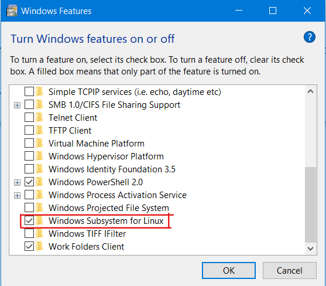

# Shell Scripting Using WSL

I am a windows user and one of the most interesting feature I was made familar with was WSL or windows subsystem for linux.
! Before you proceed further here is a disclaimer, WSL is a great feature but is only avalaible on Windows 10 and maybe it will be continued later on other subsequent versions of windows.

## How to set up WSL ?

Setting up WSL is pretty easy. The steps are -

1) Search for "Turn Windows Featuers on or off" in your machine.

2) Check the checkbox that says "Windows Subsystem for Linux".

3) Now the system may take some time and ask for a restart. So, restart it as it prompts.

4) Great! now we are good to go! Open Microsft Store and install the linux subsytem you want to use. There are many options.

5) After installion the screen will prompt you to enter username and password. Enter them and yes it's done!

6) This the screen which should appear after you have given your username and password. (Note: The screen will contain your username and computer name)

