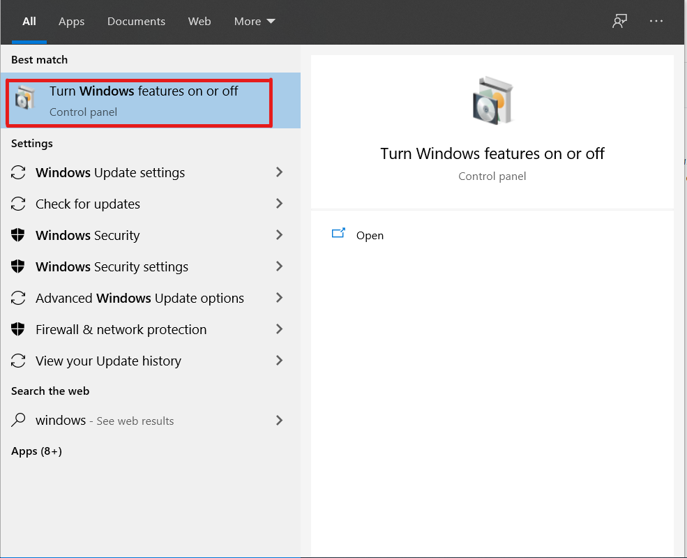

# Shell Scripting Using WSL

I am a windows user and one of the most interesting feature I was made familar with was WSL or windows subsystem for linux.
! Before you proceed further here is a disclaimer, WSL is a great feature but is only avalaible on Windows 10 and maybe it will be continued later on other subsequent versions of windows.

# How to set up WSL ?

Setting up WSL is pretty easy. The steps are -

1) Seacrch for "Turn Windows Featuers on or off" in your machine

